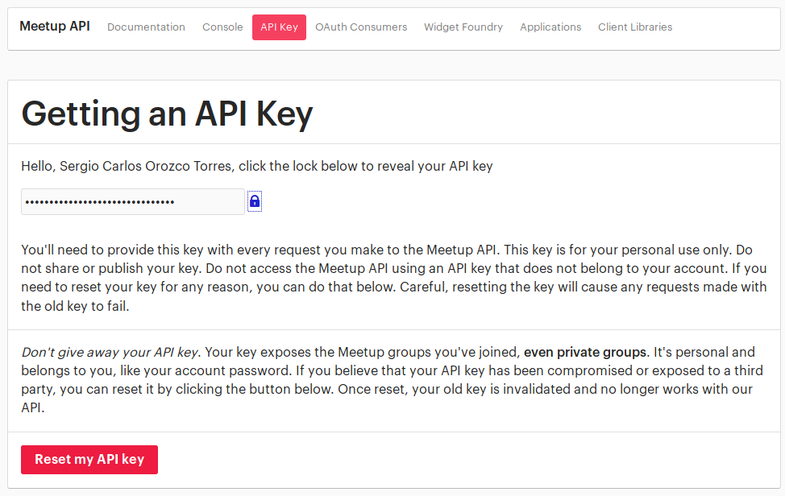

# Página web comunidad python barranquilla

[](https://travis-ci.org/PyBAQ/django-quilla-web)

## Instalación

Para poder ejecutar el proyecto localmente se requieren las siguientes dependencias:

- Python 2.7
- Imagemagick
- NodeJS 6
- [Lektor](https://www.getlektor.com/)

A continuación siga la guiá de instalación según su sistema operativo

### Windows

Para windows puede descargar python desde el siguiente enlace: https://www.python.org/downloads/

puede instalar imagemagick usando [chocolatey](https://chocolatey.org/), o descargar desde el siguiente enlace:

<http://www.imagemagick.org/>

Para instalar lektor puede usar el siguiente comando:

```powershell
    @powershell -NoProfile -ExecutionPolicy Bypass -Command "iex ((new-object net.webclient).DownloadString('https://getlektor.com/install.ps1'))" && SET PATH=%PATH%;%LocalAppData%\lektor-cli
```

Pero tambien puede ser ejecutado directamente en powershell:

```powershell
    iex ((new-object net.webclient).DownloadString('https://getlektor.com/install.ps1'))
```

### Windows 10: Windows Subsystem for Linux

Si quieres/debes mantener windows instalado, pero prefieres mantener este proyecto en linux, puedes usar el "Windows Subsystem for Linux" (subsistema de windows para linux).  La forma rápida de habilitarlo es por powershell en modo de Administrador, ten presente que necesitas reinicar tu PC:

```powershell
    Enable-WindowsOptionalFeature -Online -FeatureName Microsoft-Windows-Subsystem-Linux
```

Luego, en la tienda de microsoft encontrarás distintas distribuciones de ubuntu que podrás instalar, ten presente que esto solo te da acceso por linea de comandos. Podrás encontrar mas detalles en el siguiente vínculo: [https://docs.microsoft.com/en-us/windows/wsl/install-win10](https://docs.microsoft.com/en-us/windows/wsl/install-win10).

De allí continua los pasos según el instructivo para Linux.

### Linux

En ubuntu se pueden instalar las dependencias de lektor usando el comando:

    sudo apt-get install python-dev libssl-dev libffi-dev imagemagick

Luego puede instalar lektor usando el siguiente comando:

    curl -sf https://www.getlektor.com/install.sh | sh

### MacOS

En Mac OS si se tiene instalado [homebrew](https://brew.sh/) se pueden instalar las dependencias de lektor usando el comando:

    brew install imagemagick

Luego puede instalar lektor usando el siguiente comando:

    curl -sf https://www.getlektor.com/install.sh | sh

Verificar que las variables de entorno del formato UTF-8 en sus respectivos idiomas esten definidas en el
archivo ~/.bash_profile de su sistema y en caso de no estar definidas agregarlas.

```bash
export LC_ALL=en_US.UTF-8
export LANG=en_US.UTF-8
```

### La discusión Python3

Ahora mismo Lektor **no provee** una forma confiable y sencilla de instalar la herramienta en Linux usando Python 3. Por esto no usamos esta versión de Python. Sin embargo todos los pasos anteriormente descritos en windows funcionan sin inconvenientes usando cualquier versión de Python 3.6+. Será, sin embargo, tu responsabilidad inspeccionar el código fuente de los plugins de Lektor para segurar su compatibilidad con Python 3. Recuerda que es codigo libre y no se trata de pedir las cosas sino de contribuir a las características que deseas.


## Ejecución del proyecto durante desarrollo

Para la ejecución del proyecto se debe ejecutar el comando:

```bash
lektor server
```

Al ejecutar lektor, verás una lista de procesos que tienen lugar antes de generar la página estática. Si en tu edición cometes algún error, aparecerá escrito en la consola. Si se genera con exito la página, ésta estará disponible en [http://localhost:5000/](http://localhost:5000/).

## Código de conducta

Los invitamos a leer el siguiente [repositorio con el código de conducta](https://github.com/PyBAQ/codigo-de-conducta) de la comunidad.

### Contribuciones

Necesitamos de tu ayuda para terminar este proyecto! **¿Cómo puedes contribuir?** Mira las normas que hemos redactado en el archivo [CONTRIBUTING.md] para organizarnos mejor en el desarrollo. Esperamos tus Pull Requests e Issues. Gracias por tu apoyo.

[CONTRIBUTING.md]: https://github.com/PyBAQ/django-quilla-web/blob/master/CONTRIBUTING.md

## Actualizar eventos

Para actualizar los eventos, [Obtén un API KEY](https://secure.meetup.com/es-ES/meetup_api/key/)



En un terminal bash ejecuta los siguientes comandos

```bash
export MEETUP_API_KEY=<API_KEY>
curl -L "https://api.meetup.com/2/events?key=$MEETUP_API_KEY&group_urlname=pythonbaq" > databags/next_events.json
curl -L "https://api.meetup.com/2/events?key=$MEETUP_API_KEY&group_urlname=pythonbaq&status=past&desc=true" > databags/past_events.json
```

> por favor actualiza los eventos solo si lo consideras estrictamente necesario, entre los metadatos incluidos incluye la fecha de actualización en un timestamp (propenso a conflictos)
